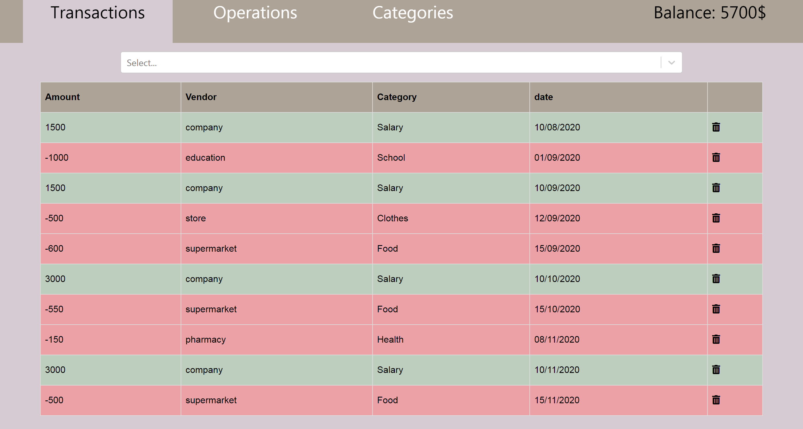
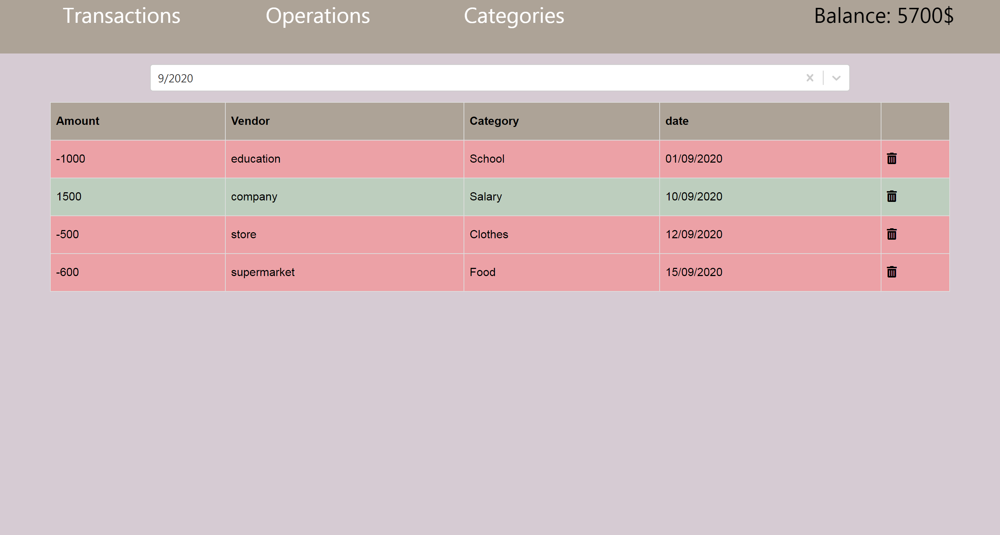
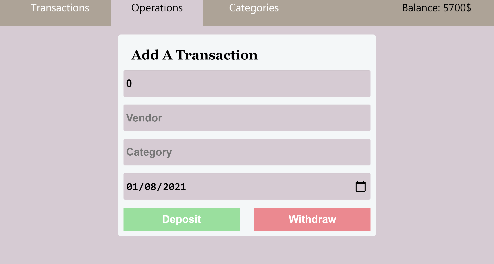
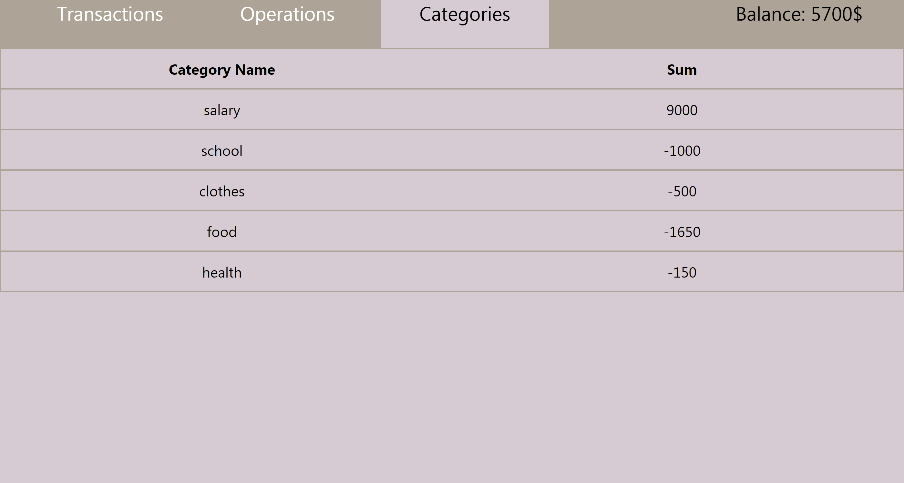
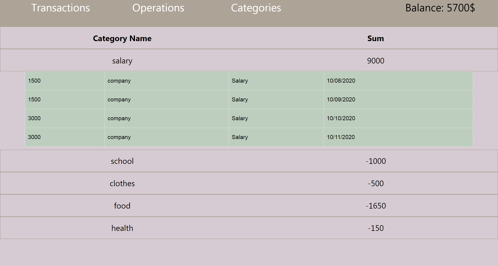

# BANK Project 🤑

It is a Full Stack **MERN** project, that displays, add, and delete the user's transactions (Deposit or Withdraw).

## 📷 project Screenshots

### 📠 Transactions

The page renders the transactions from the database. The user can delete any transaction and can filter the transactions by month.

 
 

### 🔧 Operations

A form to add a transaction (Deposit or Withdraw) to the database.

### ▤ Categories

Display the categories and if the user hover over a category, its transactions will appear.

## 💻 Technology used

- Client-side: React, Material-ui
- Server: NodeJs, Express, mongoose 
- Database: MongoDB

## 🔧 Getting Started

- Clone this repository. You will need `node`, `npm` and `MongoDB` installed globally on your machine.
- **Windows:** run `mongod` in the command line 
- run `npm install` in the bank folder and `npm i express mongoose` in the backend folder
- run `node server` in a terminal (backend folder)
- run `npm start` in another terminal (bank folder)

